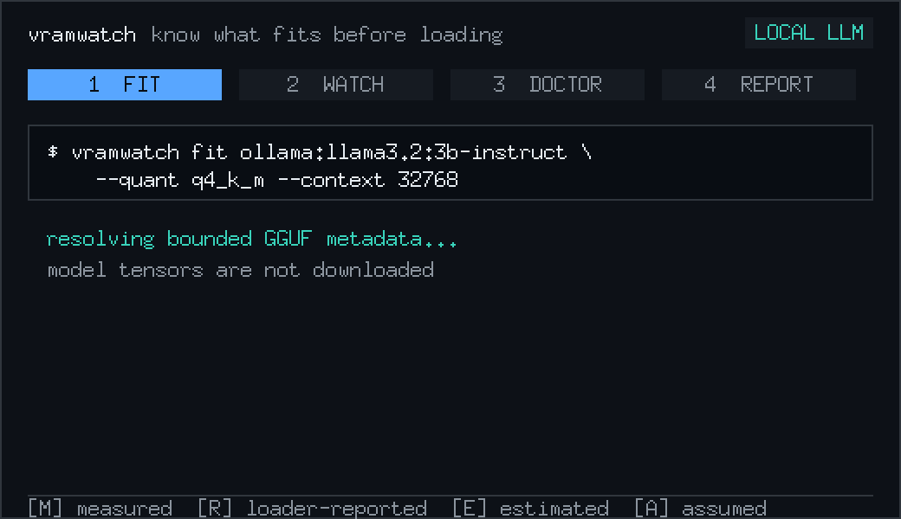
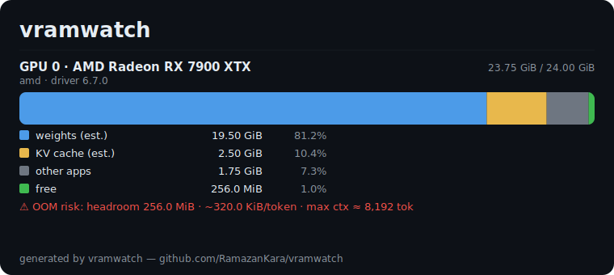

<h1 align="center">vramwatch</h1>

<p align="center"><em>The flame graph for “why won’t this model fit.”</em></p>

<p align="center">
  A single, dependency-free binary that live-traces where every megabyte of your
  local-LLM VRAM went — <strong>weights vs KV cache vs other apps</strong> — and
  predicts how much context fits before you OOM.
</p>

<p align="center">
  <a href="https://github.com/RamazanKara/vramwatch/actions/workflows/ci.yml"></a>
  <a href="LICENSE"></a>
  <a href="https://github.com/RamazanKara/vramwatch/releases"></a>
  
</p>

<p align="center"></p>

---

`nvidia-smi` and `rocm-smi` tell you a GPU is using 23.5 of 24 GiB. They can’t tell
you **why**: how much is model weights, how much is the KV cache that grows with
your context, and how much is the desktop compositor you forgot about. So when a
70B model that “should fit” OOMs at 22 GiB, you’re guessing.

vramwatch attributes VRAM **inside** the inference process and shows you the split
live:

```text
vramwatch v0.1.0

GPU 0  AMD Radeon RX 7900 XTX  (amd, driver 6.7.0)
[███████████████████████████████████████████████]  23.75 GiB / 24.00 GiB used
  █ weights      19.50 GiB   81.2%  (ollama, estimated)
  █ KV cache      2.50 GiB   10.4%  (ollama, estimated)
  █ other apps    1.75 GiB    7.3%
  █ free         256.0 MiB    1.0%
  model: llama3:70b-q4  ctx 8192/8192
  ⚠ OOM risk: headroom 256.0 MiB • ~320.0 KiB/token • max context ≈ 8,192 tokens
```

## Why vramwatch

- **Within-process attribution.** Not “process X uses 22 GiB” — but *of that 22 GiB,
  19.5 is weights and 2.5 is KV cache*. That’s the number that tells you whether a
  longer context or a bigger quant will fit.
- **OOM prediction.** It knows your model’s KV-cache growth per token, so it tells
  you the **max context that fits** and answers *“will 32k fit?”* before you try it.
- **AMD/ROCm is a peer, not an afterthought.** Most VRAM tooling is CUDA-only.
  vramwatch reads `rocm-smi` alongside `nvidia-smi`, and the weights/KV split works
  the same on both (see [Supported](#supported) for the per-process caveat).
- **Zero friction, zero deps.** One static binary. No Python, no CUDA toolkit, no
  account, nothing uploaded. `curl | sh` and go.
- **Honest.** Anything derived rather than measured is labelled `estimated`. See
  [Limitations](#limitations).

## Install

```sh
# Linux / macOS
curl -fsSL https://raw.githubusercontent.com/RamazanKara/vramwatch/master/install.sh | sh

# With Go
go install github.com/RamazanKara/vramwatch/cmd/vramwatch@latest
```

Windows: grab the `.zip` from [Releases](https://github.com/RamazanKara/vramwatch/releases),
or `go install` as above.

## Usage

```sh
vramwatch watch                 # live TUI (updates as the KV cache grows)
vramwatch snapshot              # one-shot breakdown
vramwatch snapshot --json       # machine-readable
vramwatch snapshot --svg card.svg   # branded scorecard to share
vramwatch predict --context 32768   # will 32k context fit? what's the max?
vramwatch devices               # what GPUs/loaders did I detect?
```

No GPU handy? Every command takes `--source`:

```sh
vramwatch watch --source demo   # synthetic card whose KV cache grows until OOM
vramwatch snapshot --source mock:testdata/scenarios/24gb-70b-oom.json
```

`snapshot --svg` writes a shareable scorecard:

<p align="center"></p>

### `predict`

```text
$ vramwatch predict --context 32768
GPU 0  AMD Radeon RX 7900 XTX
  model: llama3:70b-q4   ~320.0 KiB/token
  headroom: 256.0 MiB
  max context that fits: ~8,192 tokens   (OOM risk now)
  target 32,768 tokens: WON'T FIT (needs 29.50 GiB, card has 24.00 GiB)
```

## How it works

vramwatch combines two sources per GPU:

1. **The driver** (`nvidia-smi` / `rocm-smi`) — device total/used/free, plus
   per-process VRAM on NVIDIA. This is ground truth.
2. **The loader** (Ollama `/api/ps` + `/api/show`, llama.cpp `/props`) — which
   models are resident and their architecture.

It then splits the inference process’s footprint. The KV cache is computed with the
standard formula:

```
KV bytes/token = 2 (K and V) · n_layers · n_kv_heads · head_dim · bytes_per_element
```

which is GQA/MQA-aware (`n_kv_heads`). The formula also supports a quantized KV cache
(`bytes_per_element`), though v0.1 always assumes f16 until KV-dtype detection lands —
see [Limitations](#limitations). Weights are then `process_VRAM − KV − compute
overhead`. The segments always tile the device exactly:
**weights + KV + compute + other apps + free = total**.

## Supported

| GPU vendor | via         | device totals | per-process | notes |
|------------|-------------|:---:|:---:|-------|
| NVIDIA     | `nvidia-smi`| ✅ | ✅ | full support |
| AMD        | `rocm-smi`  | ✅ | ❌ | per-process not collected in v0.1; footprint comes from the loader |

The weights/KV split works on **both** vendors — it comes from the loader, not the
driver. Per-process driver attribution (which process holds what) is NVIDIA-only in
v0.1; on AMD the inference footprint is taken from the loader's reported VRAM, which
is usually a single process anyway.

| Loader   | via                       | model + VRAM | weights/KV split |
|----------|---------------------------|:---:|:---:|
| Ollama   | `/api/ps`, `/api/show`    | ✅ | ✅ (estimated from architecture) |
| llama.cpp| `/props`                  | context only | ❌ (arch not exposed over HTTP) |

## Limitations

vramwatch is deliberately honest about what it can and can’t know:

- **Weights/KV are estimated, not hooked.** v0.1 does not intercept the CUDA/HIP
  allocator; it derives the split from the loader’s reported footprint plus the
  model architecture. The KV formula is exact; the weights figure is the remainder.
  Everything derived is labelled `estimated`.
- **KV dtype is assumed f16.** Ollama doesn’t expose the cache type over its API. If
  you run a quantized KV cache, the estimate is high (a q8 cache is half the size).
- **AMD per-process VRAM is not collected in v0.1.** The tool does not query
  `rocm-smi` for per-process data, so on AMD the inference footprint always comes
  from the loader’s reported VRAM (the weights/KV split still works). Per-process
  driver attribution is NVIDIA-only for now.
- **llama.cpp** doesn’t expose VRAM or architecture over HTTP, so it contributes the
  model name and context length but no weights/KV split.
- **Prediction is linear** in the KV cache and holds weights/overhead constant — a
  good planning estimate, not a guarantee.

Roadmap items that lift these: allocator-level attribution, KV-dtype detection,
richer ROCm per-process data, vLLM/MLX providers, Apple Metal.

## Building

```sh
make build     # -> ./vramwatch
make test
make card      # regenerate the sample scorecard in docs/sample/
```

No third-party dependencies — standard library only.

## Contributing

New GPU/loader providers are the most valuable contributions. See
[CONTRIBUTING.md](CONTRIBUTING.md).

## License

[Apache-2.0](LICENSE) © Ramazan Kara
