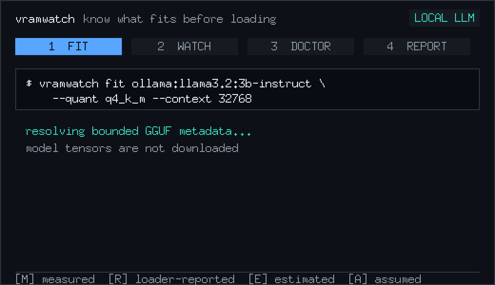
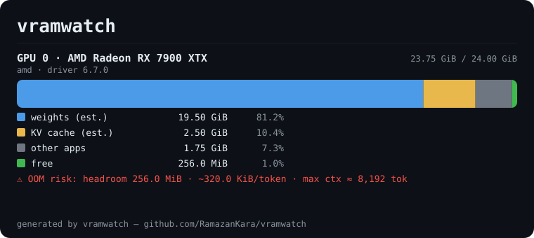

<h1 align="center">vramwatch</h1>

<p align="center"><strong>vramwatch — see why your local LLM ran out of GPU memory and determine what will fit before loading it.</strong></p>

<p align="center">
  <a href="LICENSE"></a>
  <a href="https://github.com/RamazanKara/vramwatch/releases"></a>
  
</p>

`nvidia-smi` and `amd-smi` can show that a card is full. vramwatch answers the
next questions: *why* is it full, and will this model, quantization, and context
fit before you spend time downloading or launching it?

<p align="center">
  
</p>

<p align="center"><sub>Deterministic illustrative walkthrough. Provenance badges match the real CLI: measured <code>[M]</code>, loader-reported <code>[R]</code>, estimated <code>[E]</code>, and assumed <code>[A]</code>.</sub></p>

```sh
vramwatch fit ollama:llama3.2:3b-instruct --quant q4_k_m --context 32768
vramwatch watch
vramwatch doctor
vramwatch report --svg
```

## The four commands

### `vramwatch fit MODEL --quant q4_k_m --context 32768`

Resolves a GGUF's size and architecture, computes weights + KV cache + runtime
overhead, then evaluates every detected accelerator independently. Remote models
use repository metadata and a bounded HTTP range request for the GGUF header.
The response is closed as soon as the required metadata is parsed; 16 MiB is a
hard transfer ceiling, not the routine read size. Servers that would force a
larger un-ranged response are refused.

`MODEL` accepts:

| Form | Example |
|---|---|
| Ollama registry | `ollama:llama3.2:3b-instruct` |
| Hugging Face | `hf:owner/repo` or `owner/repo` |
| Local GGUF | `/models/model-Q4_K_M.gguf` |
| HTTPS GGUF | `https://example/model-Q4_K_M.gguf` |

Useful flags (replace `./model.gguf` with an existing local GGUF):

```sh
vramwatch fit hf:bartowski/Llama-3.2-1B-Instruct-GGUF --quant q4_k_m --context 32768
vramwatch fit hf:bartowski/Llama-3.2-1B-Instruct-GGUF --file Llama-3.2-1B-Instruct-Q4_K_M.gguf --revision main --context 32768
vramwatch fit ./model.gguf --context 32768 --kv-cache-type q8_0
vramwatch fit ./model.gguf --context 32768 --vram 24GiB   # plan without detected hardware
vramwatch fit ./model.gguf --context 32768 --json
```

The answer has two intentionally different verdicts:

- `on device` compares the full model against accelerator capacity.
- `right now` also accounts for memory currently in use. If live usage could not
  be measured, this verdict is `UNKNOWN` instead of assuming the card is empty.

Each target also shows an estimated maximum context, both on the device and
right now, using the same runtime ceiling, safety reserve, and chosen KV type.
The estimate is capped by the model's context limit when known. Zero means no
positive context fits; unknown usage leaves the current limit unknown. If model
metadata omits its context limit, the estimate is based on memory alone.

Fit is conservative. It assumes full single-accelerator residency, adds a runtime
ceiling, and reserves `max(512 MiB, 5% of capacity)`. The output exposes every
component and its provenance. Exit status is `0` if at least one target fits,
`3` when a valid prediction says none fit, and `1` when the answer is
indeterminate or an operational check fails.

Private Hugging Face repositories are supported through `HF_TOKEN`. Sharded GGUF
sizes are summed and incomplete shard sets are rejected.

### `vramwatch watch`

Shows the live device bar and attributes the inference footprint into weights,
KV cache, compute/runtime, other processes, and free memory. Values carry a badge
so a derived number never looks like a measurement:

| Badge | Meaning |
|---|---|
| `[M]` | measured by the driver or OS |
| `[R]` | reported by Ollama or llama.cpp |
| `[E]` | estimated from model metadata/math |
| `[A]` | conservative policy assumption |
| `[U]` | supplied by the user |

```sh
vramwatch watch
vramwatch watch --kv-cache-type q8_0
vramwatch watch --once --no-color
vramwatch watch --once --json
vramwatch watch --json --interval 2s > samples.ndjson
```

`--json` emits one complete JSON object per line (NDJSON), without terminal
controls or a footer, even with `--color`. Each object has `schema_version: 1`,
`command: "watch"`, and a `snapshot` containing timestamps, devices, models,
segments, and provenance. `--once --json` emits exactly one object. Stop a stream
with Ctrl-C. JSON mode also records stable observations for accuracy reports.

When a resident model matches a saved fit prediction, watch displays predicted
versus observed memory. After three consecutive stable samples (2% tolerance), it records the
observation locally for the accuracy report.

For demos and provider development, `watch --source demo` and
`watch --source mock:scenario.json` remain available.

### `vramwatch doctor`

Checks the whole detection chain rather than merely looking for an executable:

- driver/provider availability and query failures;
- accelerator identity, capacity, and whether current usage is measurable;
- Ollama and llama.cpp health plus resident models;
- evidence that a resident model is actually using GPU memory;
- prediction-ledger state; and
- optionally, metadata registry reachability with `--online`.

```sh
vramwatch doctor
vramwatch doctor --verbose
vramwatch doctor --online --json
```

Failures include a targeted remediation and return status `1`. Warnings (for
example, a healthy loader with no resident model) do not turn a diagnostic run
into a failure.

### `vramwatch report`

Every `fit` invocation saves a small local prediction record unless `--no-record`
is used. `watch` or a later `report` pairs it with a matching resident model and
records the driver-measured, loader-reported, or estimated footprint. The report shows hardware,
model, quant, context, prediction, observation provenance, and signed/absolute
error.

```sh
vramwatch report                         # latest prediction, console
vramwatch report --prediction ID --json   # replace ID with a fit record_id
vramwatch report --svg                   # timestamped SVG filename
vramwatch report --svg --output card.svg
vramwatch report --markdown --static     # paste into an issue or discussion
vramwatch report --markdown --output report.md
```

SVG and Markdown are designed to share: they omit hostnames, PIDs, bus IDs, serial numbers,
local paths, and URL query strings. `--static` removes the timestamp for
reproducible output. Existing files are protected unless `--force` is supplied.
Markdown defaults to stdout; both formats accept `--output -` for stdout.
Choose one of `--json`, `--svg`, or `--markdown` per invocation.

<p align="center"></p>

## Install

```sh
go install github.com/RamazanKara/vramwatch/cmd/vramwatch@latest
```

A [shell installer](install.sh) is also available for Linux and macOS.
Windows users can use `go install` with Go 1.27.2 or newer. Existing archives
are listed under [Releases](https://github.com/RamazanKara/vramwatch/releases).
The v0.7.1 Windows binary was built with Go 1.26.3; its scan flags
standard-library advisories, including [GO-2026-6218](https://pkg.go.dev/vuln/GO-2026-6218).
Use a current source build until updated release archives are published.
The v0.7.1 release includes Linux amd64/arm64, Windows amd64, and macOS
amd64/arm64 archives. macOS release builds must run natively to link Metal;
native macOS execution is not part of the local Windows validation.

## What is supported

| Hardware path | Capacity/usage | Per-process evidence | Notes |
|---|:---:|:---:|---|
| NVIDIA via `nvidia-smi` | yes | yes | Linux and Windows |
| AMD via `amd-smi` | yes | Linux: `/proc/*/fdinfo` | ROCm/AMD SMI path |
| AMD on Windows via registry + `typeperf` | yes | no | usage is unknown on ambiguous multi-GPU systems |
| Apple silicon via Metal + Mach VM | unified-memory budget | no | uses Metal's recommended working set and reclaimable system memory |
| Manual `--vram` target | user supplied | n/a | prediction works without a GPU |

| Loader | Resident model discovery | Architecture/weights |
|---|:---:|:---:|
| Ollama | `/api/ps` | `/api/show` plus local GGUF blob when readable |
| llama.cpp server | `/props` | local GGUF header when the server is on loopback |

Fit does not require a running loader. Ollama and Hugging Face are model metadata
sources; `--loader` records which runtime you intend to use so a later observation
can be matched.

## How prediction works

The KV cache is computed from architecture metadata, including grouped-query and
asymmetric key/value dimensions:

```text
KV bytes = context × layers × KV heads × (key dimension + value dimension) × element width
```

The preflight policy then uses:

```text
expected      = GGUF bytes + KV bytes + max(64 MiB, 10% of weights)
conservative  = GGUF bytes + KV bytes + max(256 MiB, 15% of weights)
required      = conservative + max(512 MiB, 5% of accelerator capacity)
```

The percentage runtime terms and safety reserve are rounded up to 16 MiB.
GGUF bytes are treated as estimated GPU-resident weights because this assumes
full offload. The runtime terms and safety reserve are assumptions, clearly marked
`[A]`. See [the methodology](docs/METHODOLOGY.md) for exact arithmetic, cache
quantization widths, guardrails, and a worked example.

## Local data and network behavior

There is no account, telemetry, or upload service. Prediction records are JSON
files under the platform state directory:

- Linux: `$XDG_STATE_HOME/vramwatch` or `~/.local/state/vramwatch`
- macOS: `~/Library/Application Support/vramwatch`
- Windows: `%LOCALAPPDATA%\vramwatch`

Set `VRAMWATCH_STATE_DIR` to override this location. Unix prediction directories
and files use modes 0700 and 0600. Windows inherits directory ACLs; use a private
directory when overriding the default. Records can include the model
reference you supplied, including a local path or URL; they stay local. SVG and
Markdown output are scrubbed as described above. Raw `report --json` and
`watch --json` are intended for local automation and are not privacy-scrubbed.

Live watch/doctor query local drivers and the configured loader endpoints
(`OLLAMA_HOST` and `LLAMACPP_HOST`, defaulting to loopback). Remote `fit`
contacts the selected Hugging Face or Ollama registry, or the supplied HTTPS URL, for metadata;
`doctor --online` performs explicit registry probes.

## Limitations

- Fit models assume full residency on one accelerator. Tensor splitting, CPU/partial
  offload, speculative/draft models, adapters, and multimodel concurrency are not
  yet predicted.
- Separate Hugging Face multimodal projector files are not yet added to model
  weight totals; select the main GGUF explicitly with `--file`.
- Runtime allocator behavior varies by backend and driver. The conservative policy
  is a planning guardrail, not a guarantee against fragmentation or another process
  allocating after the sample.
- KV cache type defaults to f16. Pass `--kv-cache-type` when your loader uses a
  quantized cache.
- Prediction pairing checks the requested loader, model name or comparable digest,
  context, and quantization when both sides provide it. Exactly one model must be
  resident on the device. Missing quantization and the loader's actual KV cache
  type cannot be independently verified by this pairing.
- Apple unified memory is not dedicated VRAM. vramwatch reports the Metal working
  set budget and currently reclaimable memory, and labels the memory kind explicitly.

## Migration from 0.x

The launch CLI intentionally replaces the exploratory command names:

| Removed | Replacement |
|---|---|
| `predict` | `fit MODEL --context N` |
| `snapshot` | `report` |
| `devices` | `doctor` |

Invoking an old name returns a migration message and usage status `2`.

## Development

Install the check tools as described in [the release guide](docs/RELEASING.md#gate), then run the local targets below.

```sh
make fmt vet staticcheck test build vuln
make card   # regenerate the deterministic SVG above
make gif    # regenerate the animated README walkthrough
```

Use Go 1.27.2 or newer. The make targets need Git, GNU make, and a POSIX shell;
on Windows, use a compatible toolchain or WSL. GitHub Actions is currently
unavailable because of billing, so the local gate above is authoritative. Tests,
vet, Staticcheck, and govulncheck cover both Go modules. Tests use `-race` when
cgo is enabled, otherwise they print a skip notice. The single CI workflow runs
the same gate on push or manual dispatch. See [local release preparation](docs/RELEASING.md)
for builds, native macOS checks, and `SHA256SUMS`; publication is a separate manual step.

The CLI module has no third-party Go dependencies. The standalone `docs/gifgen`
module uses `golang.org/x/image`. Provider parsing, prediction,
ledger persistence, privacy behavior, report rendering, and the documented
model-first fit invocation are covered by hardware-free tests. See
[Contributing](CONTRIBUTING.md), [Validation](docs/VALIDATION.md), and the
[FAQ](docs/FAQ.md).

## License

[Apache-2.0](LICENSE) © Ramazan Kara
